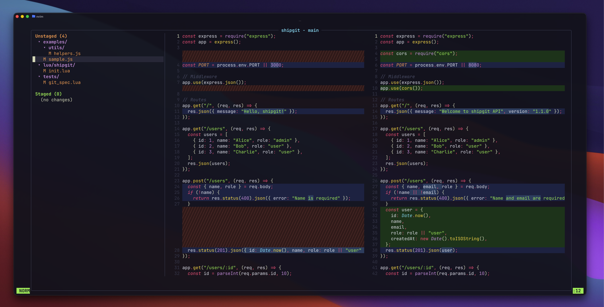

# shipgit.nvim

A fast, floating git client for Neovim with side-by-side diff powered by native Neovim syntax highlighting.




## Why shipgit?

Existing tools each have trade-offs:

- **diffview.nvim** — Great side-by-side diff, but opens in a tab, no floating window
- **Neogit** — Floating window support, but no side-by-side diff inside it
- **lazygit** — Floating TUI, but no Neovim syntax highlighting in diffs

**shipgit** combines the best of all three: side-by-side diff with Neovim's native syntax highlighting and diff engine, inside a floating window, with full git operations — all in one UI.

## Features

- **Floating side-by-side diff** with Neovim native syntax highlighting (`diffthis`)
- **File tree** with directory grouping, path compression, and collapse/expand
- **Stage/unstage** at file, directory, or hunk level
- **Edit diffs directly** — modify the right (new) panel and save with `:w`
- **Commit, push, pull** (async, non-blocking)
- **Branch management** — checkout, create, delete, merge (with confirmation), rebase, cherry-pick, with ahead/behind indicators
- **Remote branches** — switch between local/remote with `]`/`[`
- **Branch tree** — colored `git log --graph` visualization with tag create/delete
- **Stash** — push, pop, apply, drop with file tree and side-by-side diff preview
- **Commit log** — browse history with file tree, side-by-side diff, cherry-pick, infinite scroll
- **Conflict resolution** — dedicated conflict section with merge/rebase/cherry-pick abort
- **Auto-refresh** — updates on focus return
- **Project switching** — recent project history with `<C-p>`
- **File icons** — [nvim-web-devicons](https://github.com/nvim-tree/nvim-web-devicons) support (optional)
- **Unpushed branch detection** — `⚠ unpushed` indicator for branches without upstream
- **Smart push** — auto `--set-upstream` for new branches
- **Fully customizable** highlights and keymaps
- **Zero required dependencies** (nvim-web-devicons optional)

## Requirements

- Neovim >= 0.10
- [nvim-web-devicons](https://github.com/nvim-tree/nvim-web-devicons) (optional, for file icons)

## Installation

### lazy.nvim

```lua
{
  "RyoyaFukasawa/shipgit.nvim",
  dependencies = { "nvim-tree/nvim-web-devicons" }, -- optional
  config = function()
    require("shipgit").setup()
  end,
  keys = {
    { "<leader>gg", "<cmd>Shipgit<cr>", desc = "Shipgit" },
  },
}
```

### Local development

```lua
{
  dir = "~/path/to/shipgit.nvim",
  config = function()
    require("shipgit").setup()
  end,
  keys = {
    { "<leader>gg", "<cmd>Shipgit<cr>", desc = "Shipgit" },
  },
}
```

## Usage

Open shipgit with `<leader>gg` (or `:Shipgit`).

### Main View

```
╭── shipgit - main ─────────────────────────────────╮
│ Unstaged (3)     │ old (HEAD)        │ new (work) │
│  ▾  src/        │ local x = 1      │ local x = 1│
│    M  index.ts  │ print("hello")   │ print("hi")│
│    M  utils.ts  │                   │ return 42  │
│  ?  new.txt     │                   │            │
│                  │                   │            │
│ Staged (1)       │                   │            │
│  M  README.md   │                   │            │
╰──────────────────┴───────────────────┴────────────╯
```

### Keybindings

#### File List Panel

| Key | Action |
|-----|--------|
| `j` / `k` | Navigate files |
| `Space` | Stage/unstage file, directory, or hunk |
| `a` | Stage/unstage all |
| `h` | Collapse directory/file (or parent if on child) |
| `l` | Toggle directory open/close, expand file hunks |
| `c` | Commit |
| `P` | Push (async) |
| `p` | Pull (async) |
| `d` | Discard changes / abort merge, rebase, or cherry-pick |
| `o` | Open file in Neovim (closes shipgit) |
| `b` | Branch manager |
| `t` | Branch tree (graph) |
| `s` | Stash manager |
| `g` | Commit log |
| `<C-p>` | Project switcher |
| `Tab` | Focus diff panel |
| `<C-h>` / `<C-l>` | Move between panels |
| `?` | Help |
| `q` | Close |

#### Diff Panel

| Key | Action |
|-----|--------|
| `Space` | Stage/unstage current file |
| `:w` | Save edits to working tree (right panel, unstaged files) |
| `<C-h>` / `<C-l>` | Move between panels |
| `Tab` | Focus file list |
| `q` | Close |

#### Branch Manager (`b`)

| Key | Action |
|-----|--------|
| `Space` | Checkout branch |
| `M` | Merge selected branch (with confirmation dialog) |
| `r` | Rebase onto selected branch |
| `c` | Cherry-pick (opens branch log to pick commits) |
| `P` | Push |
| `p` | Pull |
| `f` | Fetch |
| `n` | Create new branch |
| `d` | Delete branch |
| `]` / `[` | Switch between Local / Remote tabs |
| `q` | Close |

#### Stash Manager (`s`)

| Key | Action |
|-----|--------|
| `j` / `k` | Navigate stashes and files |
| `h` / `l` | Collapse/expand directory tree |
| `Enter` | View file diff (side-by-side) |
| `Space` | Pop stash |
| `a` | Apply stash (keep) |
| `d` | Drop stash |
| `n` | New stash |
| `<C-h>` / `<C-l>` | Move between panels |
| `q` | Close (returns to main view) |

#### Commit Log (`g`)

| Key | Action |
|-----|--------|
| `j` / `k` | Navigate commits and files |
| `h` / `l` | Collapse/expand directory tree |
| `Enter` | View file diff (side-by-side) |
| `c` | Cherry-pick selected commit |
| `<C-h>` / `<C-l>` | Move between panels |
| `q` | Close (returns to main view) |

#### Branch Tree (`t`)

| Key | Action |
|-----|--------|
| `t` | Create tag on selected commit |
| `d` | Delete tag |
| `q` | Close |

#### Project Switcher (`<C-p>`)

| Key | Action |
|-----|--------|
| `Space` | Open project |
| `d` | Remove from history |
| `q` | Close |

## Configuration

All options are optional. Defaults shown below:

```lua
require("shipgit").setup({
  width = 0.85,          -- Fraction of editor width
  height = 0.85,         -- Fraction of editor height
  border = "rounded",    -- Border style
  filelist_width = 0.25, -- File list panel width ratio

  keymaps = {
    quit = "q",
    stage_toggle = "<Space>",
    stage_all = "a",
    commit = "c",
    push = "P",
    pull = "p",
    discard = "d",
    focus_next = "<Tab>",
    help = "?",
    next_file = "j",
    prev_file = "k",
    branches = "b",
    open_file = "o",
    tree = "t",
    stash = "s",
    log = "g",
  },

  highlights = {
    -- File list
    staged_header = { fg = "#A0E860", bold = true },
    unstaged_header = { fg = "#FF9E58", bold = true },
    staged_file = { fg = "#A0E860" },
    unstaged_file = { fg = "#FF9E58" },
    untracked_file = { fg = "#78DCF0" },
    dir_name = { fg = "#D09CDF", bold = true },
    conflict_header = { fg = "#FF5080", bold = true },
    conflict_file = { fg = "#FF5080" },

    -- UI
    border = { fg = "#505870" },
    title = { fg = "#78DCF0", bold = true },
    separator = { fg = "#505870" },
    cursor_line = { bg = "#2a2e3f" },
    help_key = { fg = "#FFD24A" },
    help_desc = { fg = "#505870" },

    -- Diff
    diff_add = { bg = "#1a3a1a" },
    diff_change = { bg = "#1a2a4a" },
    diff_delete = { bg = "#3a1a1a", fg = "#804040" },
    diff_text = { bg = "#2a4a6a" },

    -- Branch tree graph
    graph_commit = { fg = "#FFD24A", bold = true },
    graph_hash = { fg = "#56C5B8" },
    graph_head = { fg = "#A0E860", bold = true },
    graph_remote = { fg = "#FF5080" },
    graph_tag = { fg = "#FF9E58" },
    graph_branch = { fg = "#D09CDF" },
    graph_message = { fg = "#dadbc0" },
    graph_colors = {
      "#78DCF0", "#A0E860", "#FF5080", "#D09CDF",
      "#FF9E58", "#FFD24A", "#56C5B8", "#E06880",
    },
  },
})
```

### Colorscheme Integration Example

```lua
-- tokyonight
require("shipgit").setup({
  highlights = {
    staged_header = { fg = "#9ece6a", bold = true },
    unstaged_header = { fg = "#e0af68", bold = true },
    border = { fg = "#565f89" },
    diff_add = { bg = "#20303b" },
    diff_delete = { bg = "#37222c" },
  },
})
```

## Commands

| Command | Description |
|---------|-------------|
| `:Shipgit` | Open shipgit |
| `:ShipgitClose` | Close shipgit |
| `:ShipgitToggle` | Toggle shipgit |

## License

MIT
